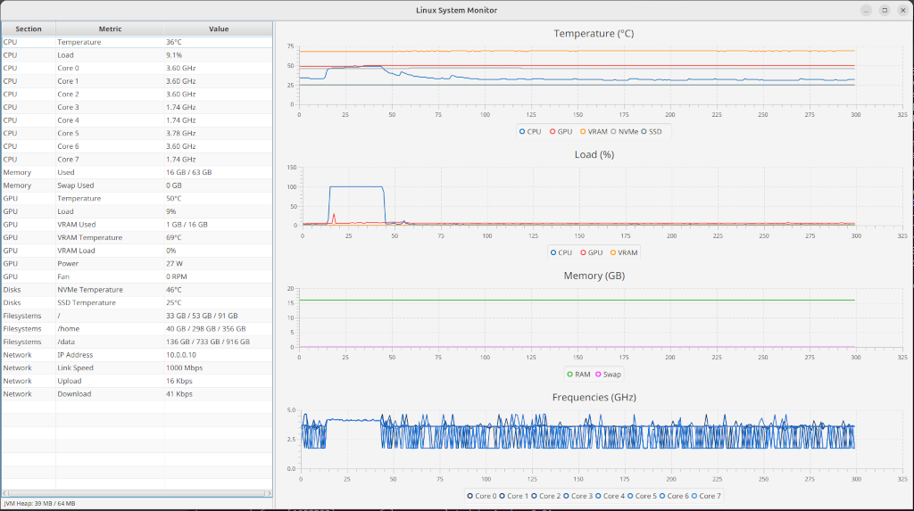
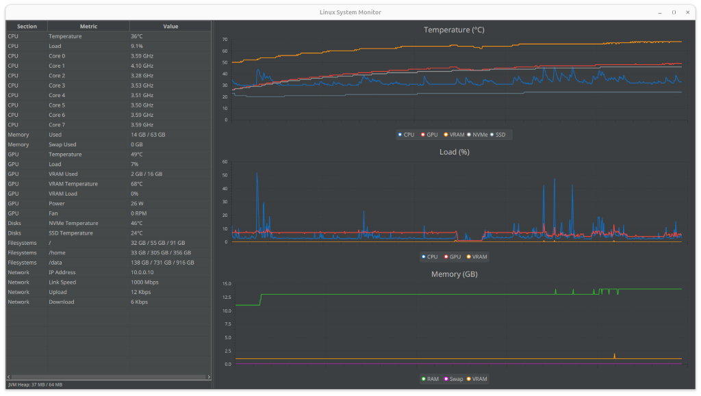

# linux-system-monitor

A JavaFX desktop application for monitoring Linux hardware metrics in real time.
Displays CPU, GPU, memory, storage, filesystem, and network statistics in a live-updating UI.

[](https://www.gnu.org/licenses/gpl-3.0)
[](https://sonarcloud.io/summary/new_code?id=lcappuccio_linux-system-monitor)





## Requirements

- JDK 21+
- Maven 3.9+
- GPU metrics are targeted at AMD, I do not have an nvidia or intel GPU to test
- `smartctl` (for SATA drives temperature only), with the following sudoers rule:

```
$YOUR_USER_HERE ALL=(ALL) NOPASSWD: /usr/sbin/smartctl
```

All metrics are read from standard Linux kernel interfaces (`/proc`, `/sys`). No additional drivers or user-space tools required with the exception of smartctl that requires sudoer access.

## Build

```bash
mvn checkstyle:check sonar:sonar -Psonar

mvn clean javafx:jlink
```

## Run

```bash
# Development
mvn javafx:run

# Packaged
./target/linux-system-monitor-1.0.0/bin/linux-system-monitor

# Distribution
./target/linux-system-monitor.zip
```

## Monitored Metrics

| Section | Metrics |
|---|---|
| CPU | Temperature, load, per-core frequency |
| Memory | Used/total RAM, used/total swap |
| GPU | Temperature, load, VRAM used/total, VRAM temp, VRAM load, power (PPT) |
| Disks | NVMe temperature, SATA SSD temperature |
| Filesystems | Used/free/total for `/`, `/home`, `/data` |
| Network | LAN IP, link speed, upload/download rate |

## Installation

```bash
# Extract
mkdir -p ~/.local/share/linux-system-monitor
unzip linux-system-monitor.zip -d ~/.local/share/linux-system-monitor

# Install launcher + icon (user space)
mkdir -p ~/.local/share/applications ~/.local/share/icons/hicolor/512x512/apps
cp linux-system-monitor.desktop ~/.local/share/applications/
cp linux-system-monitor/icon.png ~/.local/share/icons/hicolor/512x512/apps/linux-system-monitor.png

# Refresh desktop database
update-desktop-database ~/.local/share/applications/
```

## Configuration

On first run, create `~/.config/linux-system-monitor/config.properties`:

```properties
# Linux System Monitor - default configuration
# Override by creating ~/.config/linux-system-monitor/config.properties

# time logged (minutes) = (history.size * tick.seconds) / 60 (seconds)
# 300 ticks at 2 seconds per tick will show 10 minutes of history
history.size=300
tick.seconds=2
ui.theme=dark

net.interface=enp9s0
gpu.drm.path=/sys/class/drm/card1
disk.sata.device=/dev/sda
fs.mountpoints=/,/home,/data
poll.interval.default=2
poll.interval.filesystem=60
poll.interval.disk.temp=15

# valid values: KBps, MBps, GB/s, Kbps, Mbps, Gbps
network.speed.unit=Kbps

# chart colours
chart.color.cpu=#0A6FC2
chart.color.gpu=#F44336
chart.color.vram=#FF9800
chart.color.nvme=#9E9E9E
chart.color.sata=#607D8B
chart.color.memory.used=#2EB82E
chart.color.swap.used=#FF00FF
chart.color.cpu.clocks=#0A305C,#0D3C73,#0F488A,#1254A1,#1461B8,#176DCF,#176DCF,#3086E8,#4794EB,#5EA1ED,#75AEF0,#8CBCF2,#A3C9F5,#BAD7F7,#D1E4FA,#E8F2FC

# Chart group visibility
chart.group.temperature.enabled=true
chart.group.load.enabled=true
chart.group.memory.enabled=true
chart.group.frequencies.enabled=false
```

If the file is absent, the application starts with built-in defaults and logs a warning.
If a configured hardware device or path does not exist, the affected collector is skipped and an error
is logged — the rest of the application continues normally.

JVM memory usage can be configured with the `-Xmx` flag, e.g. `-Xmx256m` for 256 MB of max heap.

```bash
vi bin/linux-system-monitor

#!/bin/sh
JLINK_VM_OPTIONS="--add-opens=javafx.graphics/com.sun.javafx.sg.prism=ALL-UNNAMED -Xms16m -Xmx64m"
DIR=`dirname $0`
$DIR/java $JLINK_VM_OPTIONS -m org.lcappuccio.systemmonitor/org.lcappuccio.systemmonitor.Main "$@"
```

## Fault Tolerance

Each collector validates its paths and devices independently at startup. If a configured
hardware device or path does not exist, the affected collector is marked as `UNAVAILABLE`
and an error is logged — the rest of the application continues functioning normally.

- **CollectorStatus enum**: `OK` (all good), `DEGRADED` (partial data), `UNAVAILABLE` (no data)
- **hwmon discovery**: Paths like `/sys/class/hwmon/hwmon*` are discovered at runtime by reading
  the `name` file, not hardcoded
- **IOException handling**: All sysfs/procfs reads return `Optional.empty()` or empty collections
  on failure; the poller never crashes
- **UI resilience**: The JavaFX UI updates through `Platform.runLater()` and continues even
  when individual collectors are unavailable

## License

This project is licensed under the GNU General Public License v3.0 — see [LICENSE](LICENSE) for details.

## Reference

JavaFX Darcula CSS theme [darculafx](https://github.com/mouse0w0/darculafx/tree/master)
